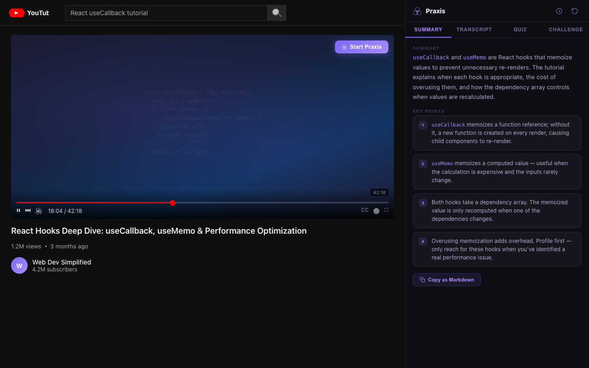
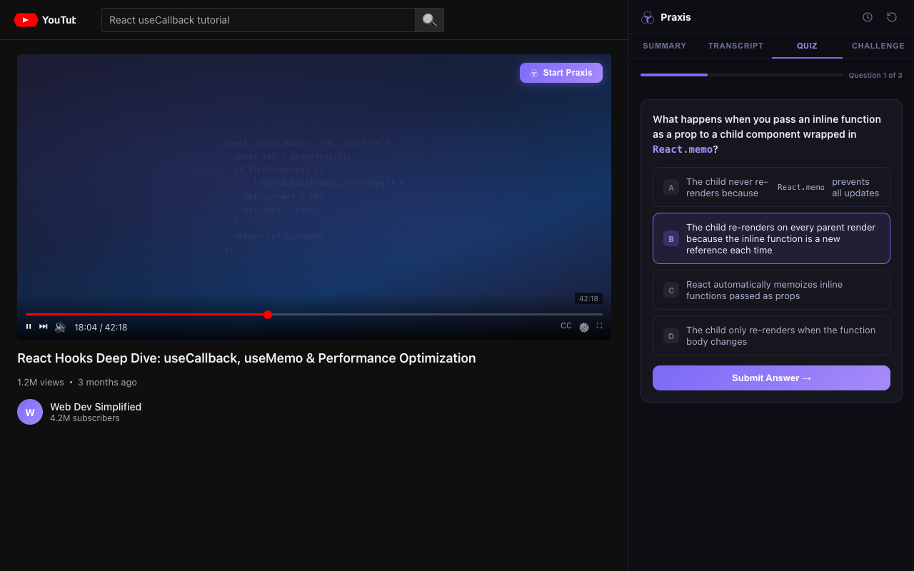
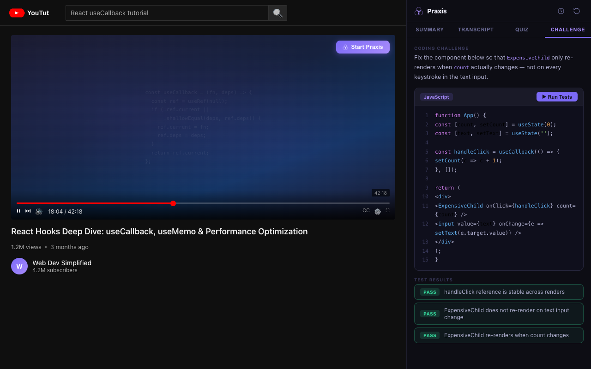
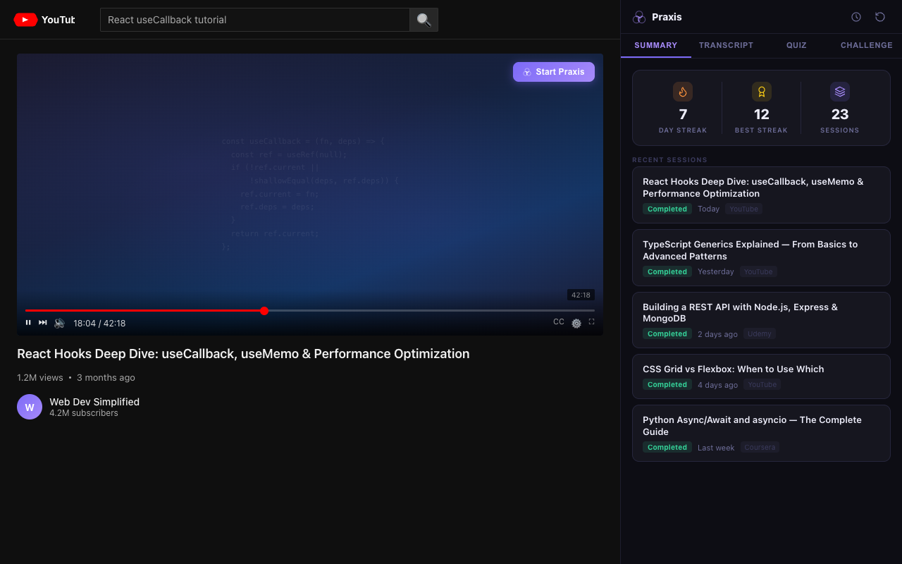

# Praxis

**Turn any tutorial video into a full learning session.**

Praxis is a Chrome extension that watches you watch. Open a coding tutorial on YouTube (or Udemy, Coursera, and more), and Praxis generates a summary, quizzes you on the content, and drops you into a live coding challenge, all without leaving the browser.

You bring an API key. Praxis does the rest.

---

## How it works

```
Watch → Summary → Quiz → Code → Done
```

1. **Summary** - AI reads the transcript and pulls out what was actually taught: key concepts, a short summary, and click-to-seek timestamps.
2. **Quiz** - 3 questions (multiple choice, predict-output, free-text). You need to pass before you can move on.
3. **Challenge** - A coding problem in the built-in IDE with multi-language support. Hints available; solution locked behind a confirm.
4. **Tutor chat** - Ask follow-up questions at any point. The AI answers from the video's content.
5. **History** - Every session is saved with your score, streak, and summary so you can review later.

---

## Screenshots

| Summary + Transcript | Quiz |
|---|---|
|  |  |

| Coding Challenge | Session History |
|---|---|
|  |  |

---

## AI providers

Praxis works with any of these. Pick the one you already have a key for:

| Provider | Default model | Free tier |
|---|---|---|
| **Anthropic** | Claude Haiku 4.5 | No (pay per token) |
| **OpenAI** | GPT-4o mini | No (pay per token) |
| **Google Gemini** | Gemini 2.0 Flash | Yes, generous free quota |
| **Groq** | Llama 3.3 70B | Yes, free tier available |
| **OpenRouter** | Llama 3.3 70B Instruct | Yes, free models available |

Your API key is stored locally in `chrome.storage.local` and never leaves your browser except in direct requests to the provider you configure.

---

## Installation

Praxis is not yet on the Chrome Web Store. Load it manually:

1. Clone or download this repo
2. Open Chrome and go to `chrome://extensions`
3. Enable **Developer mode** (toggle, top right)
4. Click **Load unpacked** and select the repo folder
5. Click the Praxis icon in the toolbar
6. Enter your API key and choose a provider
7. Open any YouTube coding tutorial and the side panel will appear automatically

---

## Supported platforms

Praxis auto-detects videos on:

- **YouTube** - full auto-detection and transcript extraction
- **Udemy, Coursera, LinkedIn Learning, Khan Academy, Pluralsight** - works where the platform provides VTT caption tracks

Any other site with a `<video>` element and accessible captions will also work via the generic content script.

---

## File structure

```
praxis/
├── manifest.json            # Manifest V3 config
├── background.js            # Service worker, all AI calls happen here (API key never in page context)
├── ai/
│   ├── provider.js          # Abstract base class, contract every provider must implement
│   ├── anthropic.js         # Anthropic (Claude) provider
│   ├── openai-compatible.js # OpenAI / OpenRouter / Groq (shared implementation)
│   ├── gemini.js            # Google Gemini provider
│   └── index.js             # Provider factory, reads config from chrome.storage.local
├── content/
│   ├── content.js           # YouTube, auto-detects video and extracts transcript
│   ├── generic.js           # Other platforms, polls for video element
│   ├── vtt-interceptor.js   # Intercepts VTT caption network requests
│   └── vtt-page-world.js    # Page-world helper for VTT interception
├── sidepanel/
│   ├── index.html           # Side panel shell + SVG sprite
│   ├── style.css            # Design system (dark/light theme, all components)
│   ├── main.js              # Learning loop controller
│   ├── chat.js              # Tutor chat widget
│   ├── history.js           # Session history + streak stats
│   └── sandbox.html         # Isolated iframe for running user JS safely
├── options/
│   └── index.html           # Full settings page (provider, model, quiz difficulty)
├── popup/
│   └── index.html           # Toolbar popup (quick API key entry)
└── icons/
```

---

## Adding a new AI provider

If your provider speaks the OpenAI chat completions format, just add a case in `ai/index.js` pointing to `OpenAICompatibleProvider` with your `baseURL` and `defaultModel`. Done.

For a custom API format:

1. Create `ai/yourprovider.js` extending `AIProvider` from `ai/provider.js`
2. Implement all five methods: `generateSummary`, `generateQuiz`, `generateChallenge`, `evaluateAnswer`, `chat`
3. Import it and add a `case` in `ai/index.js`
4. Add the provider to the dropdown in `options/index.html` and `sidepanel/index.html`

---

## Privacy

Praxis has no backend and no account system. See [docs/privacy.html](docs/privacy.html) for the full policy.

The short version: your API key and session history stay on your device. The only data that leaves your browser is the video transcript, sent to the AI provider you configure to generate content.

---

## License

MIT
